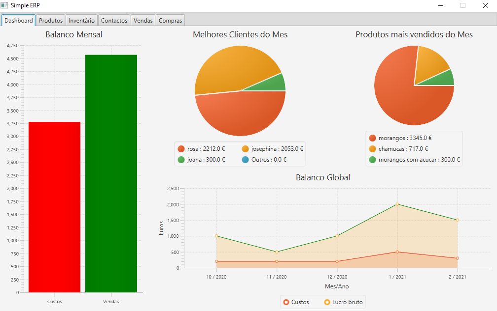

# SimpleERP

This is a desktop application to help you manage your inventory through sales and purchases. It also has a dashboard that shows profits/costs, best clients and products of the current month. Furthermore, it contains a chart with previous monthly profits and costs. All this can be observed in the image below.

 The technologies used were JavaFX framework for the UI development and Hibernate for database connection.

## Prerequisites

* Java SDK 8.0 or later
* MariaDB or other RDMS

## Installation guide

1. Create a database on your chosen RDMS.
2. Create a user (or choose an existing one) and grant him privileges to access the DB.
3. Change the persistence.xml with the information from the previous steps (mainly: name, url, user, password and driver, in case you didn't use MariaDB)
4. Download the repository.
5. Open the application folder and run .\gradlew jar (Windows) command on the command line.
6. Run the application by double-clicking the jar located on SimpleERP\build\libs.

## Features

- [x] Create and edit products.
- [x] Create and edit contacts.
- [x] Edit inventory stocks manually.
- [x] Create, edit, cancel and confirm sales/purchases.
- [x] Inventory changes accordingly to sales/purchases.
- [x] View top 3 products and contacts of current month relative to sales.
- [x] View costs/profits of current and previous month with tooltips for more details.
- [x] Add and Delete monthly cost/profit histories.

